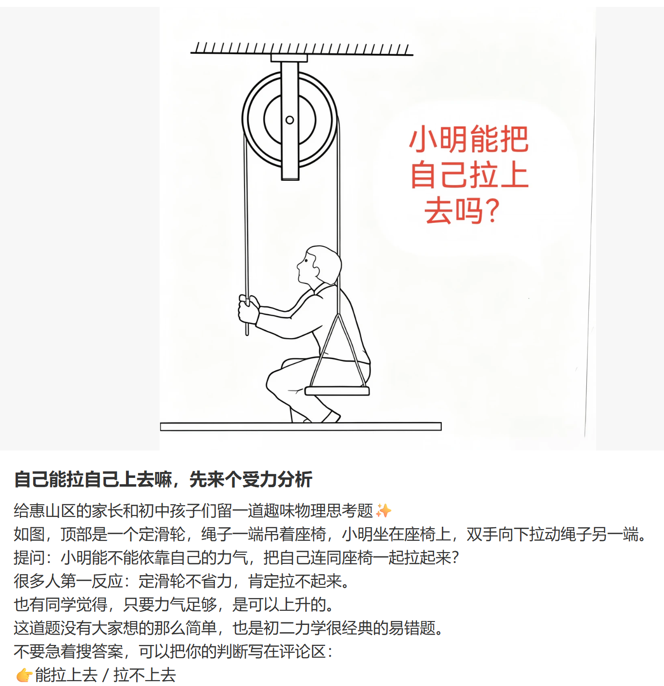

我们可以把“小明”和“他坐的椅子”看成一个整体，就像一个包裹。
向下的力：这个“包裹”有自己的重量，也就是小明的体重加上椅子的重量。我们叫它“总重量”。这个总重量想把“包裹”往下拉。
向上的力：现在看有几股绳子在往上拉这个“包裹”。
一股是吊着椅子的绳子。
另一股是小明手里拉着的绳子。
因为这是同一根绳子绕过一个滑轮，所以两股绳子向上的力气是一样大的，都等于小明自己使出的力气。
结论：这样一来，向上的力气就变成了“两倍的力气”（两股绳子各提供一份）。只要小明使出的力气，乘以2之后，比“总重量”还要大，这个“包裹”就能被拉上去了。

如果是别人站在地面上拉绳子，情况就完全不一样了。
答案依然是：能拉上去，但是会更费力。
我们可以这样简单地理解：
力的来源变了
自己拉时：小明的手向下拉绳子，绳子反过来给小明一个向上的力。这时候，手拉绳子的力和绳子拉椅子的力，都在帮小明克服重力。相当于有两股向上的力在帮忙。
别人拉时：别人站在地面上，他拉绳子的力只能作用在椅子上（通过滑轮传导）。这时候，只有一股绳子（连着椅子的那股）在提供向上的拉力。小明自己的手并没有在拉绳子产生反作用力。
受力分析（简单版）
向下的力：还是“小明 + 椅子”的总重量。
向上的力：只有一股绳子的拉力，这个拉力等于别人使出的力气。
结论
要想把小明拉上去，别人使出的力气必须大于“小明 + 椅子”的总重量。
对比一下：
自己拉：只需要用超过总重量一半的力气就能拉上去（因为有两股绳子分担重量）。
别人拉：必须用超过整个总重量的力气才能拉上去。