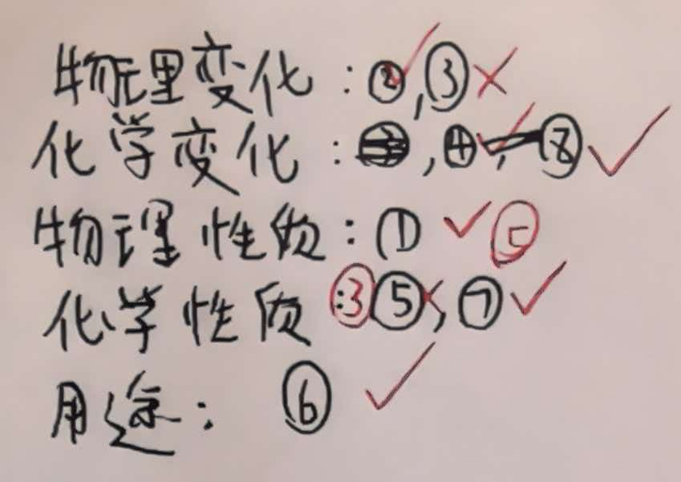

这是一道非常经典的“陷阱题”，专门用来测试你是否真正理解了“变化”与“性质”在语言描述上的细微差别。很多学霸都会在这里栽跟头。

🔥 挑战题：关于“镁”的描述大找茬

【题目】
阅读以下关于金属镁的描述，请判断各句分别属于“物理变化”、“化学变化”、“物理性质”、“化学性质”还是“用途”：

① 镁是一种银白色的有金属光泽的固体。
② 镁受热熔化成了液态。
③ 镁能在空气中燃烧，发出耀眼的白光。
④ 镁带在空气中燃烧，生成了白色粉末状固体。
⑤ 镁的密度比铝小，熔点较低。
⑥ 镁常用于制造照明弹和烟花。
⑦ 镁能与稀盐酸反应产生气泡。
⑧ 把镁条放入稀盐酸中，镁条表面产生大量气泡。

💡 核心解题技巧（必看！）

在做这道题之前，请先记住这个“黄金判断法则”：

1.  看关键词（区分变化和性质）：
    *   性质是“潜能”，通常带有：能、会、可以、易、难。（例如：能燃烧、易生锈）
    *   变化是“过程/结果”，通常描述的是正在发生或已经发生的事。（例如：燃烧了、熔化了、生成了）

2.  看本质（区分物理和化学）：
    *   物理：没变出新东西（只是形状、状态变了）。
    *   化学：变出了新东西（燃烧、生锈、腐烂、变质）。

✅ 答案与深度解析

① 镁是一种银白色的有金属光泽的固体。
*   答案：物理性质
*   解析： 颜色、状态、光泽，不需要发生化学变化就能看出来，这是它天生的样子。

② 镁受热熔化成了液态。
*   答案：物理变化
*   解析： 注意这里的描述是“熔化成了”，这是一个过程。虽然状态从固态变液态，但物质还是镁，没有新物质生成。

③ 镁能在空气中燃烧，发出耀眼的白光。
*   答案：化学性质
*   解析： （易错点！） 看到“燃烧”别急着选化学变化。请注意前面的字——“能”。这句话描述的是镁具备燃烧的能力，而不是正在燃烧的过程。

④ 镁带在空气中燃烧，生成了白色粉末状固体。
*   答案：化学变化
*   解析： 这里描述的是一个具体的实验现象和结果，“生成了”新物质（氧化镁），所以是化学变化。

⑤ 镁的密度比铝小，熔点较低。
*   答案：物理性质
*   解析： 密度、熔点、沸点，这些都属于物理性质。

⑥ 镁常用于制造照明弹和烟花。
*   答案：用途
*   解析： “用于……”、“做……”通常指用途。这是利用了镁燃烧发光的性质。

⑦ 镁能与稀盐酸反应产生气泡。
*   答案：化学性质
*   解析： 关键词“能”。这描述的是一种反应能力（活泼性），属于化学性质。

⑧ 把镁条放入稀盐酸中，镁条表面产生大量气泡。
*   答案：化学变化
*   解析： 这是一个实验操作的描述，气泡正在产生，反应正在进行，有新物质（氢气）生成，所以是化学变化。

📝 总结口诀
*   性质是“能、会、易”，变化是“了、着、过”。
*   物理无新物，化学有新物。
*   用途看“用于”，性质看“本身”。

这道题如果你能全对，那初二化学第一单元的这块内容你就彻底通关了！要不要再来一道关于“实验操作纠错”的题目？那个也是考试必考的难点。

